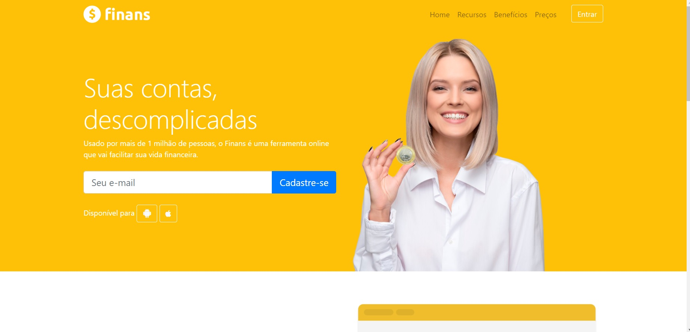

<h1 align="center"> Projeto Site Finans </h1>

Site Elaborado com as aulas ministradas pelo Professor Jailton Damasceno!

  <a href="#-tecnologias">Tecnologias</a>&nbsp;&nbsp;&nbsp;|&nbsp;&nbsp;&nbsp;
  <a href="#-projeto">Projeto</a>&nbsp;&nbsp;&nbsp;|&nbsp;&nbsp;&nbsp;
  <a href="#-layout">Layout</a>&nbsp;&nbsp;&nbsp;|&nbsp;&nbsp;&nbsp;
  <a href="#memo-licença">Licença</a>

  

 

  

## 🚀 Tecnologias

Esse projeto foi desenvolvido com as seguintes tecnologias:

- HTML e CSS
- JavaScript
- Bootstrap 5
- Git e Github

## 💻 Projeto

O projeto Finans, trata-se de um site ficticio de gestão Financeira, site profissional e responsivo.

## 🔖 Layout

O Layout Foi fornecido pelo professor Jailton Damasceno!

## :memo: Licença

Esse projeto está sob a licença MIT.

---

Feito com ♥ by Douglas Martins Distributed By DSM Mídia
